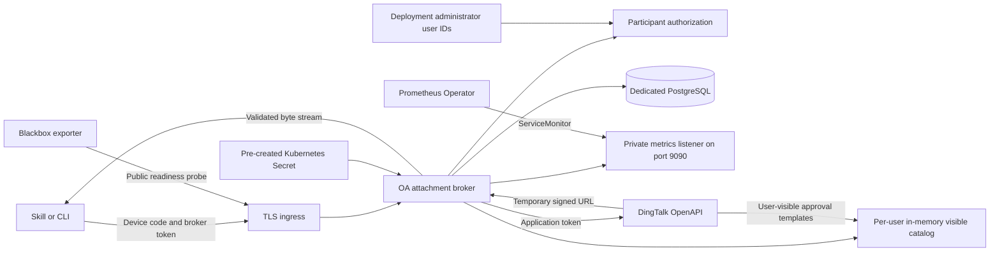
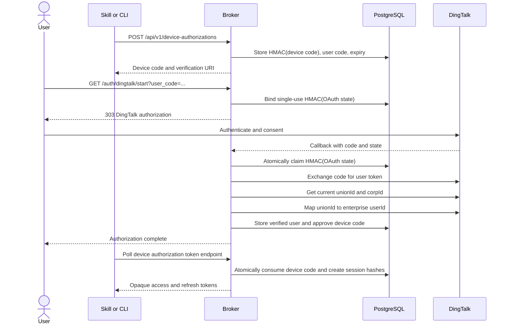
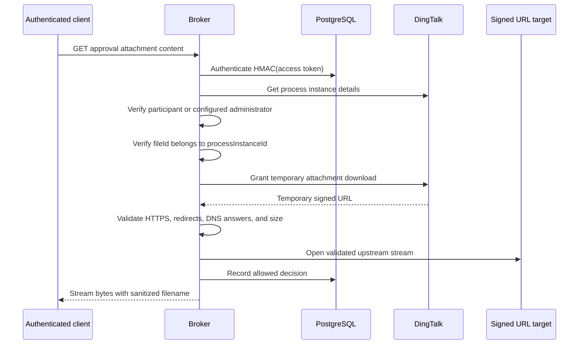
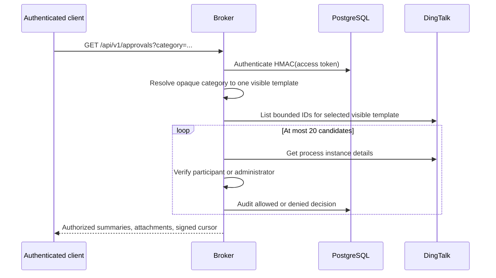
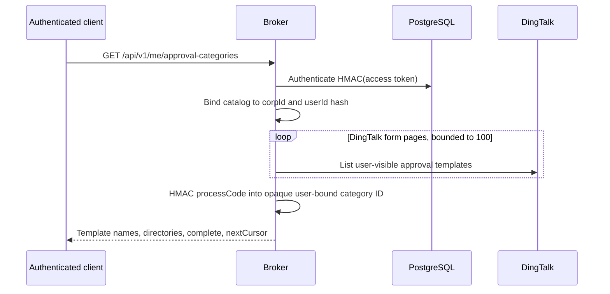
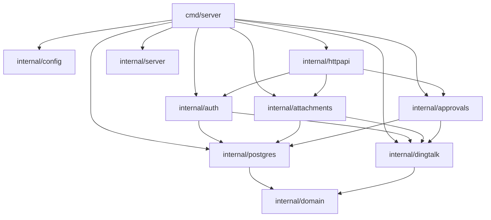
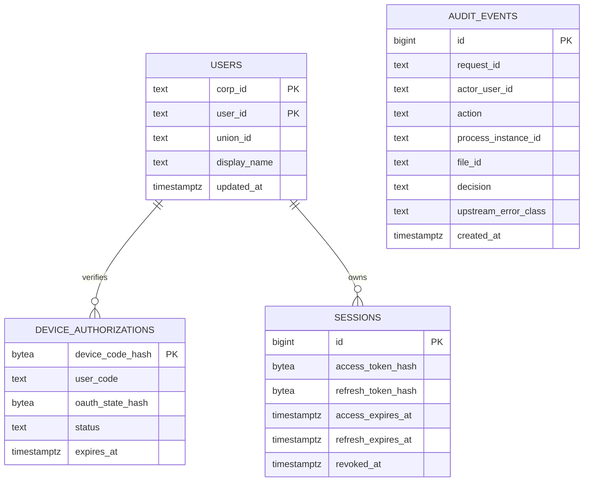

# Architecture

## Security boundary

The broker is the only component permitted to hold the DingTalk application
secret or request an OA attachment download URL. Clients hold only opaque,
short-lived broker credentials.

The service has no approval mutation dependency and does not expose endpoints
for create, agree, reject, return, or transfer actions.

## Device authorization sequence

The DingTalk user token exists only within the callback request. The database
contains only HMAC values for device, OAuth state, access, and refresh
credentials.
Consent denial and failures after state claim move the device authorization to
a terminal denied state, so polling clients stop immediately instead of waiting
for expiry.

## Attachment download sequence

Denied requests are audited with a stable error category. Tokens, URL query
signatures, form content, and attachment bytes are not audit fields.

## Category search sequence

One request inspects at most 20 candidate instances. Work is distributed
within the selected user-visible template, detail calls use bounded
concurrency, and each user is limited to six search requests per minute per
replica by default.

## Current-user category discovery

The catalog contains only templates DingTalk reports visible to the current
enterprise `userId`. It is cached in memory for one minute, capped at 5,000
templates, and never persisted. Each API page returns at most one hundred
categories. Category and approval-search cursors contain only a hash of the
enterprise subject, expire after one hour, and are rejected when used by a
different `corpId` or `userId`.

## Package boundaries

## Data model

Migrations are embedded in the migration binary. They are forward-only and
serialized with a PostgreSQL advisory lock.

Expired device authorizations and sessions past their refresh or revocation
retention are removed by the application once per day. Audit events use a
separate, longer retention window. Cleanup queries are supported by migration
managed indexes and preserve every active or refreshable session.
