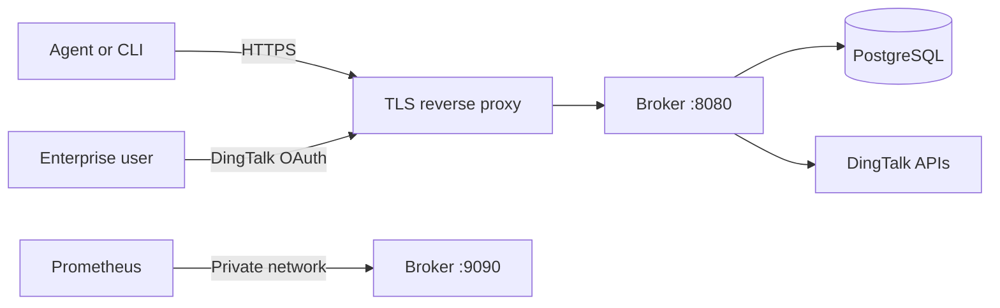

# Deployment

Each deployment serves exactly one DingTalk enterprise. Do not share one Broker
across unrelated `corpId` values.

## Topology



Terminate trusted TLS before the Broker, preserve the original host, and keep
the metrics listener private. A production deployment should run at least two
Broker replicas when availability matters; all replicas share PostgreSQL but
keep rate-limit and category caches in memory.

When the reverse proxy changes the TCP source address, set
`TRUSTED_PROXY_CIDRS` to the proxy-owned CIDRs. The Broker accepts
`X-Forwarded-For` only from those direct peers and walks the chain from right to
left to select the first non-proxy address. Configure the proxy to replace or
append the header. Never trust a CIDR that includes clients able to connect
directly to the Broker.

## Prerequisites

- A dedicated PostgreSQL database and role on a supported major version.
- A DNS name and trusted TLS certificate.
- A DingTalk enterprise internal application owned by the deploying enterprise.
- The exact callback `${PUBLIC_BASE_URL}/auth/dingtalk/callback` registered and
  published in the DingTalk application version.
- The required DingTalk permissions in
  [DingTalk application setup](dingtalk-application.md).
- A secret store for the application credentials, database URL, and token
  pepper.
- The CIDRs of reverse proxies that may supply `X-Forwarded-For`, when needed.

## Select or Build the Image

Every successful `main` workflow publishes a scratch image for `linux/amd64`
and `linux/arm64`. For a repeatable deployment, select the immutable tag for the
commit being deployed:

```bash
export BROKER_IMAGE="ghcr.io/cdryzun/dingtalk-oa-attachment-broker:sha-<commit>"

docker pull "${BROKER_IMAGE}"
docker image inspect --format '{{index .RepoDigests 0}}' "${BROKER_IMAGE}"
```

Replace `<commit>` with the full 40-character Git commit SHA. Record and deploy
the registry-resolved digest. Do not deploy the mutable `latest` tag.

To build the same scratch image locally instead:

```bash
docker build --pull --tag dingtalk-oa-attachment-broker:local .
export BROKER_IMAGE="dingtalk-oa-attachment-broker:local"
```

The image contains `/server` and `/migrate` and runs as UID/GID `65532`.

## Configure Secrets

Start from `.env.example`, but store real values outside Git. Restrict the file
to the deployment operator when using `docker --env-file`.

```bash
cp .env.example broker.env
chmod 600 broker.env
```

Generate `TOKEN_PEPPER` with a cryptographically secure source:

```bash
openssl rand -base64 48
```

The secret contract is:

| Environment variable | Requirement |
| --- | --- |
| `DINGTALK_CLIENT_ID` | Internal application client ID |
| `DINGTALK_CLIENT_SECRET` | Internal application client secret |
| `DINGTALK_CORP_ID` | Exact enterprise `corpId` accepted at login |
| `DATABASE_URL` | Dedicated PostgreSQL connection URL |
| `TOKEN_PEPPER` | At least 32 random bytes |

Do not place secret values in images, manifests, CI logs, pull requests, or
operator documentation. Use TLS for PostgreSQL whenever the database traffic
leaves a trusted local network.

## Apply Migrations

Run `/migrate` from the same immutable image before starting a new application
revision:

```bash
docker run --rm \
  --env-file broker.env \
  --entrypoint /migrate \
  "${BROKER_IMAGE}"
```

The migration binary reads only `DATABASE_URL`, embeds forward-only SQL,
serializes concurrent migration attempts with a PostgreSQL advisory lock, and
never performs an automatic downgrade. Application readiness remains false
until PostgreSQL is reachable and all required tables exist.

## Start the Broker

Bind the public listener behind a TLS reverse proxy and bind metrics only to a
private interface:

```bash
docker run --rm \
  --name dingtalk-oa-attachment-broker \
  --env-file broker.env \
  --publish 127.0.0.1:8080:8080 \
  --publish 127.0.0.1:9090:9090 \
  --read-only \
  --cap-drop ALL \
  --security-opt no-new-privileges \
  "${BROKER_IMAGE}"
```

The image runs as UID and GID `65532`. The process needs no writable root
filesystem and no Linux capabilities.

Verify the deployment through both the internal and external paths:

```bash
curl --fail --silent http://127.0.0.1:8080/healthz
curl --fail --silent http://127.0.0.1:8080/readyz
curl --fail --silent http://127.0.0.1:9090/metrics
curl --fail --silent https://broker.example.com/readyz
```

Replace the example origin with the deployment's `PUBLIC_BASE_URL`.

## Kubernetes

A Kubernetes deployment should provide:

- a pre-deployment Job that runs `/migrate` from the application image;
- a Secret containing the five required secret values;
- two or more replicas with rolling updates and a PodDisruptionBudget;
- readiness on `/readyz` and liveness on `/healthz`;
- a read-only root filesystem, non-root UID, dropped capabilities, and runtime
  default seccomp;
- a private Service or NetworkPolicy path to port 9090;
- ingress-level distributed rate limiting because application limits are local
  to each replica;
- restricted PostgreSQL egress and encrypted database transport.

The repository intentionally does not prescribe a specific ingress controller,
secret manager, or GitOps product.

## Acceptance

Before making the deployment available to users:

1. Complete a real DingTalk login with a non-sensitive test user.
2. Verify users from another `corpId` are rejected.
3. Compare one user with broad template visibility and one restricted user.
4. Verify participant access and unrelated-user denial.
5. Verify a wrong `fileId` returns not found.
6. Download a non-sensitive test attachment and compare its SHA-256.
7. Confirm logs contain no token, OAuth code, signed URL, form content, or
   attachment bytes.
8. Record the image digest and previous digest selected for rollback.

## Upgrade and Rollback

Apply migrations before updating replicas. Schema changes must remain backward
compatible with the previous application image. Roll back by restoring the
previous verified image digest; do not attempt to downgrade migrations
automatically. See [Operations and rollback](operations.md) for incident checks.
