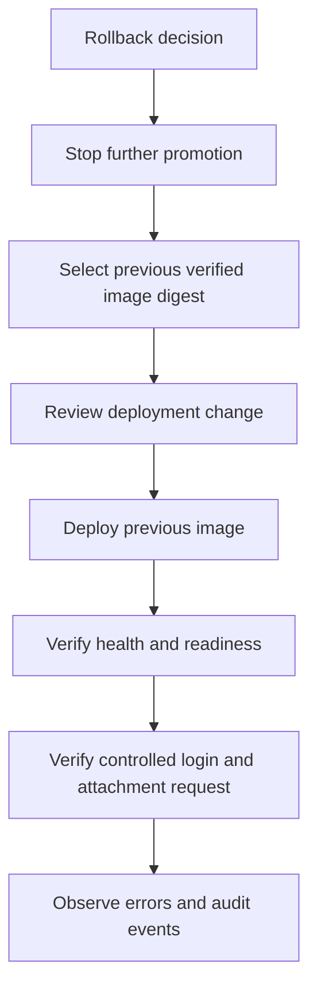

# Operations and Rollback

## Health and telemetry

| Signal | Purpose |
| --- | --- |
| `GET /healthz` | Process liveness only |
| `GET /readyz` | PostgreSQL connection and required schema |
| Private `GET :9090/metrics` | Prometheus text exposition |
| `broker_http_requests_total` | Requests by route and status |
| `broker_http_request_duration_seconds` | Request latency by normalized route |
| `broker_attachment_download_bytes_total` | Streamed attachment bytes |
| `broker_attachment_stream_errors_total` | Streams that failed after headers |

JSON logs include request ID, normalized route, status, duration, and source
address. Callback query parameters, authorization headers, raw tokens, signed
URLs, and attachment content are excluded.
The logged source address and application rate-limit key use the direct peer by
default. When `TRUSTED_PROXY_CIDRS` is configured, a valid right-to-left
`X-Forwarded-For` chain from a trusted direct peer supplies the client address.

The public port returns `404` for `/metrics`. Prometheus must reach the private
listener through a restricted network path. Probe the public `/readyz` endpoint
separately to detect TLS, DNS, proxy, and external routing failures.
Readiness is subject to the per-source request limit because it queries
PostgreSQL; liveness remains exempt. A 429 response includes `Retry-After`.

Authenticated attachment APIs also emit one business event when the operation
finishes:

All events include `event`, `outcome`, `requestId`, `corpId`, `actorUserId`,
`processInstanceId`, and `durationMs`.

- `attachments.list` success adds `attachmentCount`. Failure adds
  `errorClass`.
- `attachments.download` always adds `fileId`. Success adds `bytesWritten`
  and `contentLength`. Stream failures add the available byte counts and
  `errorClass`; failures before streaming add only `errorClass`.

The stable `outcome` values are `success` and `failure`. Business events never
include display names, attachment filenames, raw errors, authorization
headers, tokens, signed URLs, URL query strings, or attachment content. Use
`requestId` to correlate a business event with the normalized HTTP access log
and the PostgreSQL audit event.
Audit writes retain request context values but use a detached five-second
deadline, so a client disconnect cannot cancel a security decision record.

Recommended alerts:

- no ready replicas for five minutes;
- sustained HTTP 5xx rate above one percent;
- sustained DingTalk 429 responses;
- attachment stream errors above baseline;
- migration Job failure;
- PostgreSQL connection saturation;
- audit prune failure for more than one day.

A production deployment should alert on Broker scrape failure, public endpoint
failure, HTTP 5xx responses, attachment stream errors, and TLS certificates
approaching expiry. Database saturation and migration failure require separate
platform-level alerts.

## Incident triage

1. Capture the response `X-Request-ID`.
2. Correlate application logs without requesting user credentials.
3. Check `/readyz` and PostgreSQL connectivity.
4. Separate authentication, authorization, DingTalk API, and storage stream
   failures by problem code and audit error class.
5. Confirm that no signed URL or credential entered logs.
6. Reproduce only with a non-sensitive test approval.

## Audit retention

The application deletes audit events older than the configured retention once
per day. The default is 180 days. Database backups and legal retention are
separate platform responsibilities.

Expired device authorizations, non-revoked sessions whose access and refresh
lifetimes both ended before the configured authentication retention cutoff, and
revocations older than that cutoff are deleted once per day. The default
authentication record retention is seven days. Active and refreshable sessions
are never removed by this job.
Audit pruning and authentication-state pruning each receive an independent
30-second deadline so a slow audit backlog cannot starve session cleanup.

## Deployment change gate

Before promoting a deployment, present:

- image commit SHA and digest;
- changed Kubernetes objects;
- migration file names and forward-compatibility assessment;
- development login and download evidence;
- current `/healthz` and `/readyz` results;
- previous image digest selected for rollback.

## Rollback

Application rollback changes only the Deployment image to the previously
recorded immutable digest. Database migrations are not downgraded.

All schema changes must remain backward compatible with the previous
application image. If a migration is not backward compatible, deployment is
blocked until an explicit forward repair and recovery plan exists.

## Credential incident

If a client secret or token pepper is exposed:

1. disable affected access at the secret authority;
2. rotate the DingTalk client secret or token pepper;
3. revoke active Broker sessions when the pepper changes;
4. update the deployment secret without committing its value;
5. restart every Broker replica;
6. review logs and audit data for the exposure window.
