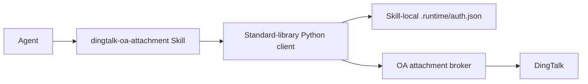

# Skill Integration

## Responsibility split

The Skill is a thin client. The broker owns all DingTalk credentials, identity
verification, authorization policy, audit writes, signed URL handling, and
streaming security.

The Skill never accepts a DingTalk client secret, app token, user token, signed
URL, nickname, or phone number.

## Distribution Contract

The complete `skills/dingtalk-oa-attachment` directory is the source of truth.
Install or copy `SKILL.md`, `agents/openai.yaml`, `scripts/`, and `references/`
together. Keep the files from one repository revision aligned and run the
embedded client tests before distributing a release.

The installer must configure `DINGTALK_OA_BROKER_URL` with the enterprise's
self-hosted Broker origin. The Skill and client contain no shared hosted
default.

## Commands

The client contract provides:

- `login`: create a device authorization, open or print the verification URL,
  poll, and store the resulting broker session;
- `logout`: revoke the current broker session and remove its local credential
  cache;
- `categories`: compatibility alias that returns the first page of the current
  user's DingTalk-visible template catalog;
- `my-categories`: filter and cursor-paginate all templates visible to the
  authenticated enterprise user;
- `search`: find authorized approvals with attachments by category and signed
  user-bound cursor, with an optional approval-content keyword;
- `list`: list authorized attachment metadata for a `processInstanceId`;
- `download`: stream one attachment to a temporary file, calculate SHA-256,
  and atomically rename it.

Direct list and download commands reject visible approval numbers and require
an explicit `processInstanceId`. Search accepts only a category ID returned by
the broker. It never accepts a client-supplied DingTalk `processCode`.

## Credential storage

The client stores one broker-scoped, versioned session document in
`.runtime/auth.json` inside the Skill. This local plaintext file is ignored by
Git and must not be copied, shared, or committed. On Unix, the directory uses
mode `0700`; the file uses mode `0600`, and the client rejects broader group or
other permissions. Windows relies on the current user's filesystem access
controls.

An HTTP 401 triggers one refresh attempt and an atomic replacement of the JSON
file. An expired or revoked refresh token returns
`reauthentication_required`; run `login` and retry the original command once.
On explicit logout, the client calls `DELETE /api/v1/sessions/current` before
removing the exact local JSON file. It removes stale credentials when the
server session is already inactive, but preserves the file on network and
transient server failures so revocation can be retried.

## Download behavior

- refuse to overwrite an existing destination by default;
- create the temporary file in the destination directory;
- set restrictive file permissions;
- close and synchronize the file;
- atomically rename only after a successful stream;
- remove the temporary file on failure;
- emit JSON containing destination, byte count, and SHA-256.

The Skill should return broker problem `requestId` values for troubleshooting
without displaying credentials.

## Agent usage rules

- Use `my-categories --all` to obtain the current user's complete visible
  template catalog, then use `search` to find approvals with downloadable
  attachments. Keep `categories` only for compatibility.
- Ask for `processInstanceId` when a direct operation includes only a visible
  approval number.
- Follow `nextCursor` unchanged for another page and omit the keyword and time
  bounds. Never reuse a cursor after switching users.
- Report the DingTalk 120-day query-window and 365-day history limits instead
  of attempting an unbounded scan.
- Never claim access before the broker returns attachment metadata.
- Never broaden access after HTTP 403.
- Treat HTTP 404 for a file as failed membership validation.
- Do not request or perform OA create, agree, reject, return, or transfer
  actions.
- Do not print access or refresh tokens in agent output.
- Run `logout` only after the user explicitly asks to end the local broker
  session.
