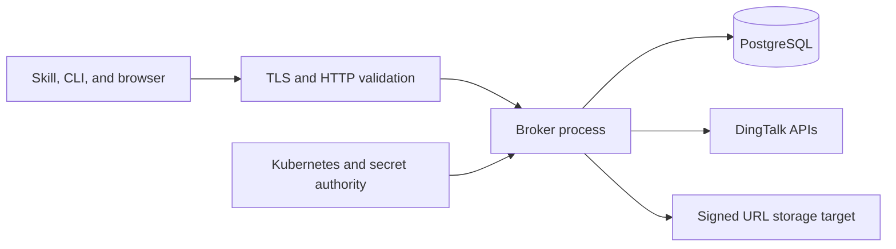

# Security Threat Model

## Assets

- DingTalk client secret and application token;
- temporary DingTalk user token;
- broker device, access, and refresh credentials;
- approval participant and attachment metadata;
- temporary signed download URL;
- attachment bytes;
- audit integrity.

## Trust boundaries

## Threats and controls

| Threat | Control |
| --- | --- |
| Stolen device code | Short expiry, HMAC storage, atomic consumption |
| OAuth CSRF | Random state, HMAC storage, one-time state binding |
| Cross-enterprise login | Exact configured `corpId` comparison |
| Identity spoofing | Server-side `unionId` to enterprise `userId` mapping |
| Token database disclosure | HMAC-SHA-256 with external token pepper |
| Refresh replay | Transactional rotation and revocation under row lock |
| Approval enumeration | User-visible catalog, time cap, result cap, cursor |
| Process-code substitution | Opaque category ID and `PROC-` rejection |
| Cursor replay | HMAC, one-hour expiry, per-candidate authorization |
| Horizontal approval access | Default-deny participant policy |
| Cross-approval file substitution | Fresh approval and file membership |
| Signed URL disclosure | URL is never serialized |
| SSRF and DNS rebinding | HTTPS, public IP validation, no proxy |
| Redirect to internal network | Every redirect and connection is revalidated |
| Oversized stream | Length check, byte cap, and timeout |
| Response header injection | Filename and disposition sanitization |
| Secret leakage in logs | Stable error classes and path-only request logging |
| Public telemetry disclosure | Private listener and scoped NetworkPolicy |
| Expired credential metadata growth | Bounded expired-record retention |
| Audit bypass | Allowed responses fail closed when audit insertion fails |
| Runtime privilege escalation | Restricted container security context |

Current cursors bind the subject, query, and category. Older cursor versions
fail closed and require the client to restart the read-only query.

## Residual risks

- DingTalk may return incomplete or differently shaped attachment metadata.
  Unknown structures fail closed but may require a reviewed parser update.
- Per-source request limiting is local to each replica. Ingress or gateway
  limits remain necessary for distributed denial-of-service protection.
- A compromised Kubernetes node or secret authority can access runtime
  credentials. Platform hardening and secret rotation remain required.
- An authorized user can copy downloaded attachment content. The broker
  controls access, not downstream data handling.
- DingTalk does not permit list discovery beyond its historical time limit.
  Older approvals require an already known `processInstanceId`.
- The public tunnel is a single external transport path. Blackbox monitoring
  detects failure, but tunnel high availability requires a separately
  validated multi-client topology.
- PostgreSQL transport encryption, backups, point-in-time recovery, and major
  version lifecycle are platform controls. A PostgreSQL 12 exception remains
  a security risk until the database is upgraded.

## Security invariants

- No approval write endpoint is present.
- No raw broker credential is persisted.
- No attachment is permanently stored.
- No signed URL is returned to a client.
- No nickname or phone number is an authorization identity.
- Any uncertain identity, relationship, or file membership result is denied.
- Category matches never grant access without participant authorization.
