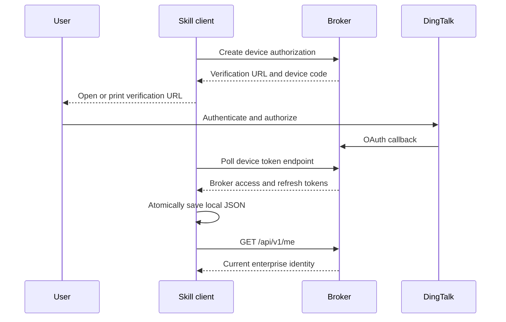

# Platform and Credential Maintenance

This reference defines supported client platforms, Broker origin selection,
credential storage, and release checks for the `dingtalk-oa-attachment` Skill.

## Contents

- [Support Matrix](#support-matrix)
- [Broker Origin and Authentication](#broker-origin-and-authentication)
- [Credential File](#credential-file)
- [Approval Selection and Downloads](#approval-selection-and-downloads)
- [Distribution](#distribution)

## Support Matrix

- Windows 10/11: Python 3.9+, launched with `py -3` or `python`. Store shared
  per-user credentials below `%LOCALAPPDATA%\DingTalkOAAttachment`.
- macOS: Python 3.9+, launched with `python3`. Store shared per-user credentials
  below `~/Library/Application Support/DingTalkOAAttachment`.
- Linux: Python 3.9+, launched with `python3`. Store shared per-user credentials
  below `${XDG_STATE_HOME:-~/.local/state}/dingtalk-oa-attachment`.

The client uses only the Python standard library. It emits UTF-8 JSON on stdout
and stderr, including when Windows inherits a legacy console code page. Process
callers must decode both streams as UTF-8.

Before declaring a platform supported, verify `--help`, `login`, `auth-status`,
session refresh, category discovery, approval search, attachment list,
download, no-overwrite behavior, `logout`, and temporary-file cleanup. Complete
Windows checks from a non-administrator account on NTFS.

## Broker Origin and Authentication

The deploying enterprise operator supplies the Broker origin. The client has no
hosted default. Configure it before every command environment:

```bash
export DINGTALK_OA_BROKER_URL="https://broker.example.com"
```

Replace the example with the exact self-hosted origin. The CLI also accepts the
global `--broker-url` option. An absent origin returns `missing_broker_url`.
The client permits HTTPS origins and loopback HTTP for local tests; it rejects
credentials, paths, queries, fragments, and non-loopback HTTP.

Each credential file is bound to one canonical Broker origin. The client
rejects a file created for a different origin. Never infer an origin from a
DingTalk enterprise name, a user-supplied URL in an attachment request, or a
previous credential file.



The client never receives the DingTalk AppKey, AppSecret, application token,
user token, or signed attachment URL. Local JSON contains only Broker access and
refresh tokens.

Run `auth-status` before a workflow. It validates the session and performs one
bounded refresh. Run `login` only when the status command returns
`reauthentication_required`. If the browser does not open, use the returned
`verificationUriComplete` in a browser and complete DingTalk authorization.

## Credential File

Credential path precedence is:

1. Global CLI option `--credential-file`.
2. `DINGTALK_OA_CREDENTIAL_FILE`.
3. Skill-local `.runtime/auth.json`.

Use the Skill-local default only when one user owns a private writable Skill
installation. For a centrally installed, read-only, or duplicated Skill,
configure a stable absolute per-user path.

Windows PowerShell:

```powershell
$env:DINGTALK_OA_CREDENTIAL_FILE = Join-Path `
  $env:LOCALAPPDATA "DingTalkOAAttachment\auth.json"
```

macOS:

```bash
export DINGTALK_OA_CREDENTIAL_FILE="$HOME/Library/Application Support/DingTalkOAAttachment/auth.json"
```

Linux:

```bash
export DINGTALK_OA_CREDENTIAL_FILE="${XDG_STATE_HOME:-$HOME/.local/state}/dingtalk-oa-attachment/auth.json"
```

The file is intentionally plaintext JSON and must remain local to one operating
system user. Never commit, upload, email, display, or copy it to another user.
Never place it in cloud sync, a network share, or a shared home directory. On
Unix, the parent directory and file must belong to the current user. Keep the
directory non-writable by group or others, normally mode `0700`, and the file at
mode `0600`. On Windows, keep it below `%LOCALAPPDATA%` and rely on the current
user's NTFS access controls.

The file contains a schema version and canonical Broker origin. Do not edit it
by hand. Use a different absolute path for each tested DingTalk identity and do
not use one credential file concurrently with different Broker origins.

Run `logout` only when the user explicitly asks. The command revokes the server
session before deleting local state. Network and transient server failures
preserve the file so revocation can be retried. Malformed files, symbolic links,
non-regular targets, and unsafe parent directories return
`credential_store_error` without deleting anything.

## Approval Selection and Downloads

A number copied from the DingTalk UI is a `businessId`; list and download
endpoints require `processInstanceId`. Present `businessId`, title, status,
`createTime`, and `processInstanceId` together before selection.

For batch work, use one directory per `businessId`. Sanitize attachment names
for the target platform, preserve extensions, refuse overwrite by default, and
retain the returned SHA-256 for verification.

## Distribution

The source of truth is the complete directory:

`skills/dingtalk-oa-attachment`

Distribute `SKILL.md`, `agents/openai.yaml`, `scripts/`, and `references/`
together. Exclude `.runtime/`, `__pycache__/`, test downloads, local environment
files, and credential files. After changing the API or client, run the Skill
validator, Python tests, syntax compilation, and one real non-sensitive device
login and download smoke test.
